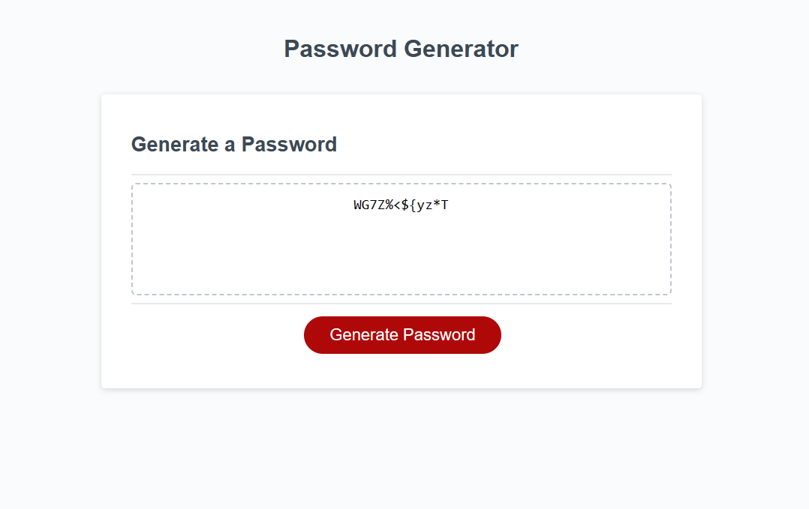

# JavaScript Password Generator

## Table of Contents

- [Description](#description)
- [Code Languages](#code-languages)
- [Installation](#installation)
- [Usage](#usage)

## Description

The purpose of this project is to modify the given starter code to create an application that enables employees to generate random passwords based on criteria that they’ve selected. The user can choose to include the following criteria in their password: uppercase, lowercase, number, and special characters, with a minimum of 8 characters and a maximum of 128 characters.

## Code Languages

- HTML
- CSS
- JavaScript

## Installation

- Not required.
- You can view the screenshot or live website in the Usage section, below.

## Usage

- It is a normal webpage and no particular instruction is needed.
- Preview the homepage or visit the live website by
 [clicking here, JavaScript Password Generator](https://skhai77.github.io/js-password-generator/).

